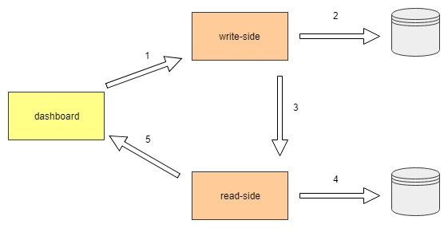
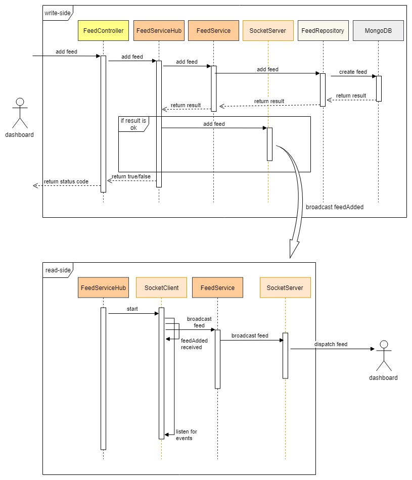

# Socket communication nodejs

This project wants to be an help for me to learn and improve some concepts related to distributed systems and socket communication.

## System Explained

The system is composed of 3 services:

- dashboard: the front end application for inserting and showing data.
- write-side: the service the handles the incoming requests (insert commands) from the front end.
- read-side: the service the handles the outcoming queries (get commands) to the front end.

From the dashboard is possible to add a new data (feed). The write-side service inserts the data in the database (mongoDB) and dispatch the data to the read-side. The read-side service dispatch the data to clients.

### Architecture

The following picture shows the flow of the data through main components

Currently the database for read-side doesn't exist. The read-side waits for a new data and dispatch directly to clients.

#### Sequence Diagram

The following picture shows the sequence diagram for add command.

## References

### Miscellaneous

- https://www.valentinog.com/blog/socket-io-node-js-react/
- https://medium.freecodecamp.org/simple-chat-application-in-node-js-using-express-mongoose-and-socket-io-ee62d94f5804
- https://rfvallina.com/blog/2015/11/12/share-private-node-dot-js-modules-across-applications-locally.html

- https://www.twilio.com/blog/2017/06/writing-a-node-module-in-typescript.html